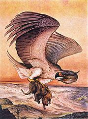

Rukh 5
======

## About
Originally developed for the Environmental Quality Board (_Junta de Calidad Ambiental_, JCA), this application maintains an accounting of out-standing debts specifically those resulting from bounced checks. Parallel accounting of these was required for these, to allow for the closing of the fiscal year. Previously all accounting for these out-standing debts was kept track on a Excel file on a single computer. 

### Goals
This project had as its goals the following:

1. Create a persistent database store for the accounting of out-standing debts.
2. Allow easy monitoring of said debts.
3. Allow for importing of data (from csv).
4. Present an API for other agencies (particularly the permit agency) to connect to and report outstanding debts. (not implemented)

Further goals were:
- Automatic generation of Mailers for collection efforts. (1/2 complete)
- Tracking of payment plans. (not implemented)

### Name
Rukh was originally 'RucPoc -- registro único de cuentas por cobrar' (literally 'single registry for out-standing debts') but now it's just a meaningless-name associated with the [Rukh](http://en.wikipedia.org/wiki/Roc_(mythology)) from Arabian Nights. The '5' represents it's on Rails 5. 

## Use
Please see [__Using__](app/views/static_pages/_using.en.md).

### Code Organization
This app was developed using **BDD** and **Hexagonal Rails** design, that is the buisness logic should be as much as possible in the `/lib` folder and talk to the controller or model through self-contained method calls. Search YouTube for ["GoRuCo 2012 Hexagonal Rails by Matt Wynne"](https://youtu.be/CGN4RFkhH2M) for more details on Hexagonal Rails.
The `/lib` folder isn't automatically reloaded. The `/logic` and the `helper` folders were used instead. 

## Testing
To run tests run `rspec spec`.

To run the rubocop linter run `rubocop -D`.

## License 
The code is under the __GPL3__ license. 

This application was created solely by David Acevedo (© David Acevedo 2015-2017).  

rukh image: [wikimedia commons](http://en.wikipedia.org/wiki/File:Edward_Julius_Detmold49.jpg): Charles Maurice Detmold (1883-1908)

---
